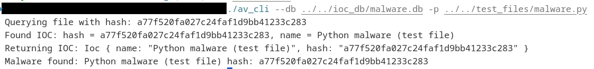

# **Work in Progress**

Right now its check the md5 hash sum of given file and compare it with hashes inside malware_db
if given files hash == hash in malware db = Virus detected - {Virus name}

## ToDo
* [] README
* [] Send scanning logs and malware samples to server///
* [] Write a blog post about this project
* [] Add Real-Time Monitoring
* [X] Add YARA Integration
* [] Improves user experience and auditability.
* [] Heuristic Analysis
* [X] Quarantine
* [] Machine Learning-Based Detection
* [X] Optimize Database Performance
* [] Add Real-Time Database Updates from cloud (server)
* [] Scan active process 
* [] Add rules with excluded dirs, files, processes
* [X] Add Directory Scanning
* [X] Generate detailed scan reports (HTML)
* [X] Add Sha256 hash
