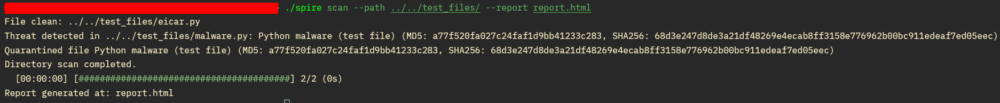

# Spire AV


**SPIRE** is being developed as a robust malware protection solution for both Linux and Windows, aimed at protecting end users from known malware and threats.

**Please note**: This project is not currently designed for mass consumption; you may encounter teething issues in the deploy process - you can raise an issue for me to fix; but I provide no guarantee it will work without issue on your deployment. This is a POC project first and foremost. There may be some bugs, or incomplete features on the main branch as I develop it. For bugs, please raise an issue. Incomplete features will be in progress, so please do not raise issues for those.

## Motivation

1. **Purpose of the Project**: Initially, my goal was to create a firewall to deepen my understanding of the Rust programming language. While exploring relevant resources, I frequently encountered publications from antivirus companies, which piqued my interest. This led me to pivot towards developing my own antivirus software. Given the scarcity of open-source projects and resources on this topic on GitHub and elsewhere, I decided to contribute to this domain by building a novel solution.
2. **Choice of Rust**: My primary objective was to enhance my proficiency in the Rust programming language, known for its performance and safety features.
3. **Use of Multiple Languages**: While Rust offers significant advantages, creating comprehensive graphical user interface (GUI) applications with it currently poses challenges. Consequently, I selected Python for developing the user interface due to its simplicity and accessibility. For server-side development, I chose Go for its efficiency and suitability for my requirements.

# Structure

| Module | Description |
|--------|-------------|
| Av_core| Core of the AV |
| AV_cli | Main cli logic |
| Av_Gui | GUI client |z
| Av_db ( Planned to Deprecated ) | Antivirus database |

# Planned Features

## Client

* [  ] Transmit suspicious files to the server for detailed analysis
* [  ] Log activities, collect system data, and send it to the server
* [  ] Enable automatic database updates from the server
* [  ] Implement configuration management
* [  ] ...

## Core

* [ X ] Scan specified directories for threats
* [ X ] Perform scans using YARA rules
* [  ] Conduct behavioral analysis of files
* [  ] Enable real-time monitor mode
* [  ] Implement TCP/IP filtering for malicious hosts and ports
* [  ] Scan newly created files on disk for static Indicators of Compromise (IOCs)
* [  ] Analyze newly created files for Import Address Table (IAT) patterns
* [  ] Execute files in a sandbox upon detection of an executable launching from the kernel
* [  ] ...

## Server

* [  ] Develop cloud-based file scanning capabilities
* [  ] Create a basic website and API for the application
* [  ] ...


# Installation

1. Copy git repo
2. Build
3. Run

```
git clone https://github.com/Tokyo-09/spire
cd spire
cargo build --release
```


# Usage

```
Usage: spire <COMMAND>

Commands:
  scan
  yara-scan
  process-scan
  quarantine
  config
  monitor
  update-db
  help          Print this message or the help of the given subcommand(s)

Options:
  -h, --help     Print help
  -V, --version  Print version
```

## Example usage

[]

```
# Regular scan
./spire scan --db malware.db --path /home/ --report report.html

# Yara scan
./spire yara-scan --rules yara/ --db /malware.db --path /home/ --report report_yara.html

# List files inside quarantine
./spire quarantine list --db ../../db/malware.db

# Restore file from quarantine
./spire quarantine restore --db ../../db/malware.db --id 6
```
